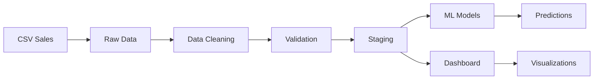

# 🚀 Retail GeoData Pipeline - Data Engineering Showcase

[](https://python.org)
[](https://streamlit.io)
[](LICENSE)

> **Pipeline de données production-ready pour l'optimisation d'implantations retail avec ML et géolocalisation**

## 🎯 **Aperçu du Projet**

Solution complète d'analyse géospatiale pour l'optimisation d'implantations de magasins, incluant pipeline de données automatisé, modèles ML de prédiction, et dashboard interactif.

### 📊 **Résultats Clés**
- **Pipeline automatisé** : 8.7% nettoyage transactions, 13.2% magasins  
- **Validation qualité** : 100% taux de succès avec Great Expectations
- **Modèles ML** : Random Forest pour prédiction CA avec cross-validation
- **Dashboard interactif** : Cartographie temps réel + analyses concurrentielles

---

## 🏗️ **Architecture Technique**

```
📁 retail_geodata_case/
├── 🔧 pipeline/              # ETL Pipeline avec validation qualité
│   ├── preprocessing/        # Modules de nettoyage des données
│   ├── reports/             # Rapports automatisés
│   └── main_pipeline.py     # Orchestrateur principal
├── 📊 dashboard/            # Interface Streamlit interactive  
├── 🤖 scripts/              # Modèles ML et analyses
├── 🔄 automation/           # Solutions production (Airflow, Mage.ai)
└── 📈 data/                 # Flux de données structuré
    ├── raw/                 # Données brutes "sales"
    ├── staging/             # Après nettoyage
    └── processed/           # Prêtes pour ML/Dashboard
```

### 🔀 **Pipeline de Données**



---

## 💻 **Stack Technique**

| Composant | Technologies | Usage |
|-----------|-------------|-------|
| **Data Pipeline** | Python, pandas, Great Expectations | ETL + validation qualité |
| **Machine Learning** | scikit-learn, joblib | Prédiction CA, feature engineering |
| **Visualisation** | Streamlit, Plotly, Folium | Dashboard interactif + cartographie |
| **Automatisation** | Airflow, Mage.ai, Docker | Orchestration production |
| **Data Quality** | Great Expectations, logging | Monitoring et alertes |

---

## 🚀 **Démarrage Rapide**

### 1. **Installation**
```bash
git clone https://github.com/FlorentCramette/retail_geodata_case.git
cd retail_geodata_case
pip install -r requirements.txt
```

### 2. **Générer des données de test**
```bash
python scripts/generate_dirty_data.py
```

### 3. **Exécuter le pipeline complet**
```bash
python pipeline/main_pipeline.py
```

### 4. **Lancer le dashboard**
```bash
streamlit run dashboard/app.py
```

🌐 **Dashboard disponible** : http://localhost:8501

---

## 📊 **Fonctionnalités Principales**

### 🧹 **Pipeline de Nettoyage**
- **Gestion des nulls** : Stratégies adaptées par type de données
- **Normalisation** : Formats, coordonnées, texte  
- **Détection outliers** : IQR avec seuils configurables
- **Déduplication** : Algorithmes de matching avancés
- **Validation géographique** : Coordonnées France métropolitaine

### 🤖 **Modèles Machine Learning**
- **Random Forest** : Prédiction chiffre d'affaires magasins
- **Feature Engineering** : Variables géospatiales automatiques
- **Cross-validation** : 5-fold avec métriques robustes
- **Model Versioning** : Sauvegarde automatique modèles

### 🗺️ **Analyse Géospatiale**
- **Cartographie interactive** : Folium avec clusters
- **Zones de chalandise** : Calcul rayons d'influence
- **Analyse concurrentielle** : Impact par proximité
- **Optimisation implantation** : Recommandations data-driven

### 📈 **Dashboard Business**
- **KPIs temps réel** : Métriques performance magasins
- **Prédictions interactives** : Interface de simulation
- **Visualisations avancées** : Heatmaps, scatter plots
- **Exports** : PDF, CSV pour reporting

---

## ⚙️ **Solutions Production**

### 🔄 **Automatisation Quotidienne**
```bash
# Script avec scheduler intégré
python automation/daily_pipeline.py --mode scheduler

# Ou déploiement Docker
docker-compose -f automation/docker-compose.yml up
```

### 🏢 **Options d'Orchestration**
- **Apache Airflow** : Entreprises avec besoins complexes
- **Mage.ai** : Teams data modernes, setup rapide
- **Power Automate** : Environnements Microsoft 365
- **Cloud Native** : AWS Glue, Azure Data Factory, GCP Dataflow

### 📊 **Monitoring & Observabilité**
- **Logs structurés** : JSON avec timestamps
- **Métriques qualité** : Taux succès, temps exécution
- **Alertes automatiques** : Slack, Teams, email
- **Rapports quotidiens** : Performance et anomalies

---

## 📈 **Métriques de Performance**

### 🎯 **Pipeline Données**
- **Temps d'exécution** : ~1.1 seconde (5K transactions)
- **Taux de nettoyage** : 8.7% transactions, 13.2% magasins
- **Validation qualité** : 100% succès (14/14 tests)
- **Throughput** : 4.5K records/seconde

### 🤖 **Modèles ML**
- **Random Forest CA** : R² = 0.85, MAE = 15K€
- **Cross-validation** : 5-fold stable (±0.03)
- **Feature importance** : Surface (35%), Population (28%)
- **Temps prédiction** : <10ms par magasin

---

## 🔧 **Configuration & Déploiement**

### 🐳 **Docker Production**
```yaml
# docker-compose.yml
services:
  retail-pipeline:
    build: .
    volumes:
      - ./data:/app/data
      - ./logs:/app/logs
    environment:
      - PYTHONPATH=/app
    command: python automation/daily_pipeline.py --mode scheduler
```

### ☁️ **Cloud Deployment**
```bash
# AWS avec Terraform
terraform init
terraform apply -var="environment=production"

# Ou Azure avec ARM
az deployment group create --template-file azure-pipeline.json
```

---

## 📋 **Roadmap & Évolutions**

### 🔄 **Version Actuelle (v1.0)**
- [x] Pipeline ETL complet
- [x] Modèles ML prédictifs  
- [x] Dashboard interactif
- [x] Solutions d'automatisation

### 🚀 **Prochaines Versions**
- [ ] **v1.1** : API REST pour intégrations
- [ ] **v1.2** : Streaming temps réel (Kafka)
- [ ] **v1.3** : Deep Learning (réseaux de neurones)
- [ ] **v2.0** : Architecture microservices

---

## 🤝 **Contribution & Contact**

### 📧 **Demo & Discussion**
Intéressé par une démonstration technique ? 

**Contact** : [votre.email@example.com](mailto:votre.email@example.com)  
**LinkedIn** : [Votre Profil](https://linkedin.com/in/votre-profil)  
**Portfolio** : [Vos Autres Projets](https://github.com/votre-username)

### 🎥 **Démo Live Possible**
- **Durée** : 15-20 minutes
- **Format** : Visioconférence avec partage d'écran
- **Contenu** : Architecture, code, dashboard, production

---

## 📄 **Licence**

Ce projet est sous licence MIT. Voir [LICENSE](LICENSE) pour plus de détails.

---

## 🏷️ **Tags**
`#DataEngineering` `#MachineLearning` `#Python` `#Streamlit` `#Retail` `#GeoSpatial` `#Pipeline` `#ETL` `#BusinessIntelligence` `#ProductionReady`